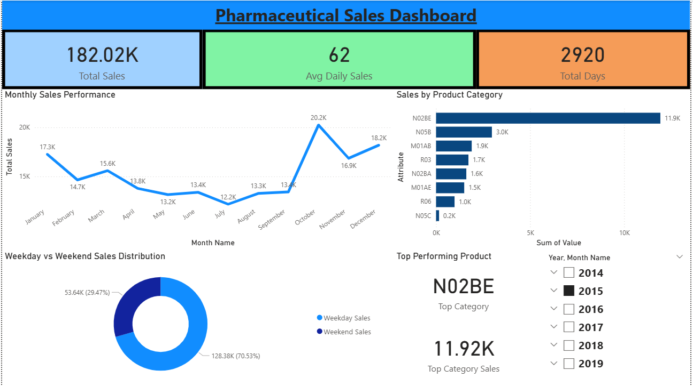

# 💊 Pharma Sales Analysis Project

## 📌 Project Overview

This project focuses on analyzing daily pharmaceutical sales data to uncover meaningful insights that can support business decision-making. Using SQL for data cleaning and Power BI for visualization, the project transforms raw data into an interactive dashboard highlighting key performance metrics.

---

## 🎯 Objective

The main objective of this project is to:

* Clean and prepare raw sales data
* Analyze sales performance and trends
* Identify top-performing products and customer patterns
* Present insights through an interactive dashboard

---

## 🛠️ Tools & Technologies Used

* **SQL** – Data cleaning and transformation
* **Power BI** – Data visualization and dashboard creation
* **Excel / CSV** – Dataset handling

---

## 📂 Dataset Description

The dataset contains daily pharmaceutical sales records, including:

* Product information
* Sales quantity
* Revenue details
* Customer-related data

---

## ❓ Business Questions Solved

* Which products generate the highest revenue?
* What are the daily sales trends?
* Which customers contribute the most to total sales?
* Are there any noticeable patterns in sales performance?

---

## 🧠 SQL Work

* Cleaned raw dataset by handling missing values
* Replaced NULL values with 'Unknown'
* Structured data for efficient analysis
* Wrote queries to extract key sales insights

---

## 📊 Dashboard Preview

---

## 📈 Key Insights

* Identified top-performing products contributing significantly to revenue
* Observed trends in daily sales performance
* Analyzed customer purchasing behavior
* Highlighted areas with potential for business growth

---

## 📊 KPI Metrics Tracked

* Total Sales
* Total Quantity Sold
* Revenue by Product
* Daily Sales Trends

---

## 🚀 How to Use

1. Open the SQL file to review data cleaning and analysis queries
2. Load the dataset into Power BI
3. Open the `.pbix` file to explore the interactive dashboard

---

## 📌 Conclusion

This project demonstrates how raw pharmaceutical sales data can be transformed into actionable insights using SQL and Power BI. It highlights the importance of data-driven decision-making in improving business performance.

---

## 📬 Contact

Feel free to connect or reach out for feedback and opportunities.
